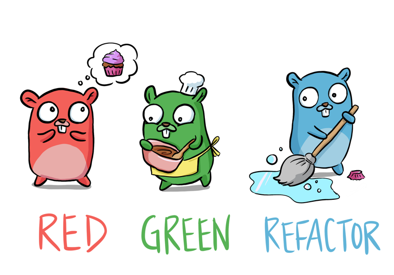

# Learn Go with Tests

[插画作者：Denise](https://deniseyu.io/)

> **译注**：本站是《Learn Go with Tests》的中文翻译，基于上游 commit `4675d96` 重译，并将随上游持续更新。官方中文版已多年未跟进，本站希望填补这个空缺。**39/40 篇已译完并上线**（前言 + 六个板块；仅剩《用 testing/synctest 重访时间》正在收尾。上游的 contributing 与 chapter template 为贡献者文档，不在翻译范围）。发现翻译问题欢迎到 [GitHub 仓库](https://github.com/zeta2333/learn-go-with-tests-zh)反馈。

## 支持作者

这本书免费开放，但如果你读着觉得受益，想表达一下感谢：

* [在 Twitter 上找 quii](https://twitter.com/quii)
* [Mastodon](https://mastodon.cloud/@quii)
* [请作者喝杯咖啡](https://www.buymeacoffee.com/quii)
* [在 GitHub 上赞助作者](https://github.com/sponsors/quii)

## 用 Go 学习测试驱动开发（TDD）

* 通过编写测试来探索 Go 语言
* **打下 TDD 的底子**。Go 是学 TDD 的好选择：语言简单易学，测试又是内置的
* 读完之后，你会信心十足地着手用 Go 编写健壮、测试完备的系统

其他语言版本：

* [Português](https://larien.gitbook.io/aprenda-go-com-testes/)
* [日本語](https://andmorefine.gitbook.io/learn-go-with-tests/)
* [Français](https://goosegeesejeez.gitbook.io/apprendre-go-par-les-tests)
* [한국어](https://miryang.gitbook.io/learn-go-with-tests/)
* [Türkçe](https://halilkocaoz.gitbook.io/go-programlama-dilini-ogren/)
* [فارسی](https://go-yaad-begir.gitbook.io/go-ba-test/)
* [Nederlands](https://bobkosse.gitbook.io/leer-go-met-tests/)
* [Tiếng Việt](https://sons-organization-15.gitbook.io/learn-go-with-tests)
* [Русский](https://eda-1.gitbook.io/lgwt/)

（这些翻译各自维护、更新进度不一。中文版就是你现在读的这一本，基于上游最新内容重译。）

## 背景

我有一些向开发团队介绍 Go 的经验，也尝试过各种办法，想把一群对 Go 有点好奇的人，带成能高效编写 Go 系统的工程师。

### 没起作用的办法

#### 啃"那本书"

我们试过一种办法：人手一本[蓝皮书](https://www.amazon.co.uk/Programming-Language-Addison-Wesley-Professional-Computing/dp/0134190440)（《The Go Programming Language》），每周讨论一章，做配套习题。

我很喜欢这本书，但它需要极高的投入度。书里把概念讲得非常细——这当然是好事——可这也意味着进度缓慢而平稳，不是谁都受得了。

我发现只有一小部分人会读完某章并做完习题，大多数人不会。

#### 刷题

编程套路题（kata）很有趣，但用来学一门语言，覆盖面通常太窄——你不大可能在解 kata 时用上 goroutine。

另一个问题是大家的学习热情参差不齐。有人学得飞快，展示成果时用上的语言特性，其他人根本没见过，反而把人讲糊涂了。

到头来，这种学习方式显得相当*没体系*，东一榔头西一棒子。

### 起作用的办法

到目前为止最有效的办法，是通过通读 [go by example](https://gobyexample.com/) 慢慢引入语言基础，配上示例一起探索、集体讨论。这比"这章是回家作业"的互动性强多了。

慢慢地，团队打下了扎实的语言*语法*基础，我们就可以开始动手搭系统了。

在我看来，这很像学吉他时练音阶。

不管你觉得自己多有艺术天分，不理解基本功、不练熟手法，就很难写出好音乐。

### 我自己的办法

*我*学一门新编程语言时，通常是先在 REPL 里乱折腾，但最终，我需要更多结构。

我喜欢的做法是：探索一个概念，然后用测试把它固化下来。测试既验证我写的代码是对的，也把我学到的特性记录成了文档。

把带团队学的经验和自己的学习方式结合起来，我想试着做点东西，希望对其他团队也有用：通过写小测试学好语言基础，然后把你已有的软件设计能力拿出来，交付出色的系统。

## 本书适合谁

* 想入手 Go 的人
* 已经会一些 Go、但想深入探索测试的人

## 你需要准备什么

* 一台电脑！
* [安装好的 Go](https://golang.org/)
* 一个文本编辑器
* 一定的编程经验：理解 `if`、变量、函数之类的概念
* 用起来不算陌生的终端

## 反馈

* 到[这里](https://github.com/quii/learn-go-with-tests)提 issue / 提 PR，或者在 [Twitter 上找 quii](https://twitter.com/quii)

（中文翻译的问题请到[中文版仓库](https://github.com/zeta2333/learn-go-with-tests-zh)反馈。）

[MIT 许可证](https://github.com/quii/learn-go-with-tests/blob/main/LICENSE.md)
