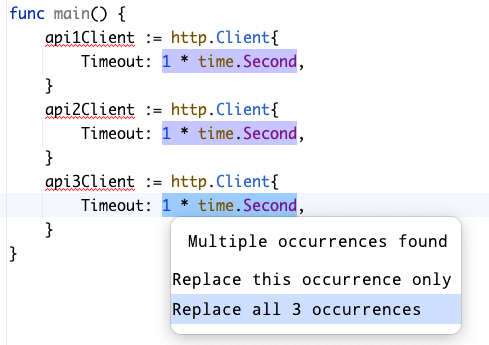

# 重构清单

重构是一项技能，练得足够多之后，多数情况下做起来都会相当容易，近乎本能。

人们常把这项活动和更重大的设计变更混为一谈，但它们是两回事。把重构和其他编程活动区分开很有帮助，因为这让我能带着清晰和纪律去工作。

## 重构与其他活动

重构只是改进现有代码，并且<u>不改变行为</u>；因此，测试不应该需要改动。

这就是为什么它是 TDD 循环的第 3 步。一旦你添加了某个行为，并且有测试为它撑腰，重构就应该是一项不需要改动测试代码的活动。如果你一边"重构"代码，一边还不得不改测试，那你**做的其实是别的事情**。

许多非常有用的重构学起来简单、做起来容易（其中很多你的 IDE 几乎能全自动替你完成），但假以时日，它们对我们系统质量的影响大得惊人。

### 其他活动，比如"大"设计

> 那我没改"真正的"行为，却必须改我的测试？这算什么？

假设你正在写一个类型，想改进它代码的质量。*重构不应该要求你改测试*，所以你不能：

- 改变行为
- 改方法签名

……因为你的测试和这两样东西耦合在一起。但你可以：

- 引入私有方法、字段，甚至新的类型和接口
- 改动公开方法的内部实现

那要是想改一个方法的签名呢？

```go
func (b BirthdayGreeter) WishHappyBirthday(age int, firstname, lastname string, email Email) {
	// 一些非常引人入胜的发邮件代码
}
```

你可能觉得它的参数列表太长了，想让代码更有内聚性、更有含义。

```go
func (b BirthdayGreeter) WishHappyBirthday(person Person)
```

这下你就是在**做设计**了，必须小心行事。如果不带着纪律做这件事，你可能把自己的代码、它背后的测试、*还有*依赖它的那些东西统统搞成一团糟——记住，用 `WishHappyBirthday` 的可不只是你的测试。但愿"真实的"代码也在用它！

**你仍然应该能由测试先行来驱动这次变更**。你可以咬文嚼字地争论这算不算"行为"变更，但你要的就是让这个方法的行为变得不一样。

既然这是行为变更，那就照样套用 TDD 流程。TDD 的一个好处是：它给你提供了一种简单、安全、可重复的方式来驱动系统中的行为变更；何必仅仅因为感觉*不太一样*就把它抛在一边呢？

这种情况下，你会改动现有的测试，让它们使用新类型。平时做 TDD 时那些迭代式的小步子——用来降低风险、带来纪律与清晰——在这些场景里同样帮得上忙。

你很可能有好几个测试都调用了 `WishHappyBirthday`；遇到这种场景，我建议把除一个之外的测试全部注释掉，把变更驱动出来，然后再怎么合适怎么来，逐个处理剩下的测试。

### 大设计

设计可能需要更大的改动、更广泛的讨论，而且通常带有一定的主观性。改系统某部分的设计，往往比重构耗时更长；尽管如此，你仍应努力降低风险，想清楚怎么小步推进。

### 见树又见林

> [如果有人**只见树木，不见森林**——英式英语说 see the wood for the trees，美式英语说 see the forest for the trees——意思是：他过于纠缠于某件事的细节，以至于注意不到这件事作为整体时真正重要的东西。](https://www.collinsdictionary.com/dictionary/english/cant-see-the-wood-for-the-trees)

当**底层代码组织良好**时，聊"大"的设计问题会容易得多。如果你和同事们每次打开一个文件，都得花大把时间在脑子里解析一堆乱糟糟的代码，那还谈什么思考代码的设计？

这就是为什么**持续不断的重构在 TDD 流程中如此重要**。如果我们不去处理那些小的设计问题，就很难为更大的系统谋划出整体设计。

令人难过的是，糟糕的代码会指数级地恶化，因为工程师们在摇摇欲坠的地基上不断堆叠复杂度。

## 动手前的心理清单

**养成习惯：每个 TDD 循环都在脑子里过一遍清单。**越是逼着自己练习，就越轻松。**这是一项需要练习的技能。**记住：下面这些改动全都不应该需要动你的测试。

我附上了 IntelliJ/GoLand 的快捷键，这是我和同事们使用的编辑器。每次指导新工程师时，我都会鼓励他们练出肌肉记忆、养成习惯，用这些工具快速而安全地重构。

### 内联变量

如果你创建了一个变量，只为把它再传给另一个方法/函数：

```go
url := baseURL + "/user/" + id
res, err := client.Get(url)
```

可以考虑把它内联进去（`command+option+n`），*除非*这个变量名带来了重要的含义。

```go
res, err := client.Get(baseURL + "/user/" + id)
```

内联别玩得*太*花；目标不是把变量消灭到零，弄出没人读得懂的离谱单行代码。如果一个值配上命名能带来重要的含义，那最好还是让它留着。

### 用提取变量 DRY 掉重复的值

"不要重复自己"（Don't repeat yourself，DRY）。同一个值在一个函数里用了多次？考虑把它提取出来，存进一个名字有含义的变量（`command+option+v`）。

这既有助于可读性，也让将来改这个值变得更容易，因为你不用记着把同一个值的多处出现挨个更新。

### 更宽泛地 DRY

[DRY](https://en.wikipedia.org/wiki/Don%27t_repeat_yourself) 如今名声不太好，倒也不算全冤枉。DRY 属于那种*太*容易在表面上理解、然后被用错的概念。

工程师很容易把 DRY 用过头，为了省下几行代码造出让人费解、纠缠不清的抽象，而不是抓住 DRY *真正*的含义：把一个*想法*收拢到一个地方。减少代码行数往往是 DRY 的副作用，**但它并不是真正的目标**。

所以没错，DRY 可能被误用，但走到另一个极端——什么都不肯 DRY——同样糟糕。重复的代码增加噪音、推高维护成本。因为害怕 DRY 被滥用，就拒绝把相关的概念或值收拢到一处，会带来*另一类*问题。

与其站在"什么都要 DRY"或"DRY 就是坏"任何一端当极端主义者，不如动动脑子，想想摆在你面前的这段代码。什么重复了？它有必要重复吗？如果把一段重复的代码封装进一个方法，参数列表看起来还合理吗？它是否感觉自文档化、是否清晰地封装了那个"想法"？

十有八九，你只要看看一个函数的参数列表：如果它看起来乱七八糟、令人困惑，那多半是 DRY 用得不高明。

如果把某段代码 DRY 起来感觉很费劲，那你多半是在把事情弄得更复杂；考虑收手吧。

DRY 时要小心谨慎，**但经常练习会改善你的判断力**。我会鼓励同事们"先试试看"，如果不对，就用版本控制回到安全的地方。

<u>**动手尝试这些事情，比讨论来讨论去更能教你东西**</u>，而版本控制配上良好的自动化测试，正是实验与学习的完美配置。

### 提取"魔法"值

> [含义不明的唯一值，或出现多次、最好用命名常量替换的值](https://en.wikipedia.org/wiki/Magic_number_(programming))

用提取变量（`command+option+v`）或提取常量（`command+option+c`）给魔法值赋予含义。可以把它看作内联重构的逆操作。我经常发现自己在内联和提取之间来回"切换"代码，帮我判断哪种写法读起来更舒服。

记住，提取重复的值也会增加一层*耦合*。所有用到这个值的东西从此耦合在了一起。看看下面这段代码：

```go
func main() {
	api1Client := http.Client{
		Timeout: 1 * time.Second,
	}
	api2Client := http.Client{
		Timeout: 1 * time.Second,
	}
	api3Client := http.Client{
		Timeout: 1 * time.Second,
	}
	// 等等
}
```

我们在为应用配置一些 HTTP 客户端。这里有一些*魔法值*，我们可以提取一个变量、给它一个有意义的名字，把 `Timeout` DRY 掉。



现在代码变成了这样

```go
func main() {
	timeout := 1 * time.Second
	api1Client := http.Client{
		Timeout: timeout,
	}
	api2Client := http.Client{
		Timeout: timeout,
	}
	api3Client := http.Client{
		Timeout: timeout,
	}
	// 等等…
}
```

我们不再有魔法值，也给了它一个有意义的名字；但与此同时，我们也让三个客户端**共享同一个 timeout**。这*也许*正是你想要的——重构相当依赖具体语境——但它值得警惕。

如果你 IDE 用得好，可以做一次*内联*重构，让各个客户端重新拥有各自独立的 `Timeout`。

### 让公开方法/函数一目了然

你的代码里有没有长得离谱的公开方法或函数？

用提取方法（`command+option+m`）重构，把这些步骤封装进私有的方法/函数。

下面这段代码里，围绕着"创建一个 JSON 字符串、再把它变成 `io.Reader`，以便放进 HTTP 请求里 `POST` 出去"，有一堆枯燥、让人分心的仪式性代码。

```go
func (ws *WidgetService) CreateWidget(name string) error {
	url := ws.baseURL + "/widgets"
	payload := []byte(`{"name": "` + name + `"}`)

	req, err := http.NewRequest(
		http.MethodPost,
		url,
		bytes.NewBuffer(payload),
	)
	// todo: 处理响应码、err 之类
}
```

第一步，用内联变量重构（`command+option+n`），把 `payload` 内联进缓冲区的创建处。

```go
func (ws *WidgetService) CreateWidget(name string) error {
	url := ws.baseURL + "/widgets"
	req, err := http.NewRequest(
		http.MethodPost,
		url,
		bytes.NewBuffer([]byte(`{"name": "`+name+`"}`)),
	)
	// 等等
}
```

现在，我们可以用提取方法重构（`command+option+m`）把 JSON 载荷的创建提取成一个函数，把噪音从方法里请出去。

```go
func (ws *WidgetService) CreateWidget(name string) error {
	url := ws.baseURL + "/widgets"
	req, err := http.NewRequest(
		http.MethodPost,
		url,
		createWidgetPayload(name),
	)
	// 等等
}
```

公开的方法和函数应当描述自己*做什么*，而不是*怎么做*。

> **每当需要动动脑子才能看懂代码在做什么时，我就会问自己：能不能重构这段代码，让这种理解变得更一目了然？**

-- Martin Fowler

这能帮你更好地理解整体设计，进而让你能对职责提出问题：

>  这个方法为什么要做 X？那件事不是应该放在 Y 里吗？

> 这个方法为什么干了这么多件事？能不能把它们归拢到别处去？

私有函数和方法非常棒；它们让你把不相干的"怎么做"打包进"做什么"里。

#### 可现在我不知道它是怎么工作的了！

这种重构风格偏爱由更小的函数和方法互相组合，对它常见的一条反对意见是：它会让人更难理解代码是怎么运作的。我直截了当的回答是：

> 你学会用工具高效地在代码库里导航了吗？

我可是*刻意*这么做的：作为 `CreateWidget` 的*作者*，我不想让"创建某个具体字符串"这件事在这个方法的叙事里扮演主要角色。对 99% 的读者来说，它是分散注意力、毫不相干的噪音。

不过，如果有人*真的*在乎，在 `createWidgetPayload` 上按一下 `command+b`（或者你的工具里对应的"跳转到符号"）……读一读就是了。再按 `command+left-arrow` 就能跳回来。

### 把值的创建挪到构造时

方法经常得创建一些值然后使用它们，比如前面 `CreateWidget` 方法里的 `url`。

```go
type WidgetService struct {
	baseURL string
	client  *http.Client
}

func NewWidgetService(baseURL string) *WidgetService {
	client := http.Client{
		Timeout: 10 * time.Second,
	}
	return &WidgetService{baseURL: baseURL, client: &client}
}

func (ws *WidgetService) CreateWidget(name string) error {
	url := ws.baseURL + "/widgets"
	req, err := http.NewRequest(
		http.MethodPost,
		url,
		createWidgetPayload(name),
	)
	// 等等
}
```

这里可以用的一种重构手法是：如果一个值被创建出来时**并不依赖方法的参数**，那你可以改为在你的类型里创建一个*字段*，在构造函数里把它算出来。

```go
type WidgetService struct {
	client          *http.Client
	createWidgetURL string
}

func NewWidgetService(baseURL string) *WidgetService {
	client := http.Client{
		Timeout: 10 * time.Second,
	}
	return &WidgetService{
		createWidgetURL: baseURL + "/widgets",
		client:          &client,
	}
}

func (ws *WidgetService) CreateWidget(name string) error {
	req, err := http.NewRequest(
		http.MethodPost,
		ws.createWidgetURL,
		createWidgetPayload(name),
	)
	// 等等
}
```

把它们挪到构造时，你就能简化自己的方法。

#### 对比前后两个 `CreateWidget`

先看最初的版本

```go
func (ws *WidgetService) CreateWidget(name string) error {
	url := ws.baseURL + "/widgets"
	payload := []byte(`{"name": "` + name + `"}`)
	req, err := http.NewRequest(
		http.MethodPost,
		url,
		bytes.NewBuffer(payload),
	)
	// 等等
}

```

经过几次基础重构——几乎全程靠自动化工具驱动——我们得到了

```go
func (ws *WidgetService) CreateWidget(name string) error {
	req, err := http.NewRequest(
		http.MethodPost,
		ws.createWidgetURL,
		createWidgetPayload(name),
	)
	// 等等
}
```

这只是一个小改进，但读起来无疑更舒服了。如果你练得足够熟，这种改进几乎花不了一分钟；只要你 TDD 做得到位，就有测试这张安全网兜底，确保你没有弄坏任何东西。这些持续不断的小改进，对一个代码库的长期健康至关重要。

### 试着消灭注释

> 我们遵循的一条经验法则是：每当觉得需要给某处代码写注释时，我们就改为写一个方法。

-- Martin Fowler

在这里，提取方法重构同样能帮上大忙。

## 规则之外

有些对代码的改进需要改动你的测试，但我仍然乐意把它们归进"重构"这个筐——尽管它破了规矩。

一个简单的例子：用 `shift+F6` 重命名一个公开符号（比如某个方法、类型或函数）。这当然会同时改动生产代码和测试代码。

但由于这是一次**自动化且安全**的变更，很多人在其他类型的*设计*变更中容易陷入的那种"测试和生产代码一起越改越坏"的螺旋，在这里风险微乎其微。

出于这个原因，凡是能用你的 IDE/编辑器安全完成的变更，我依然乐意称之为重构。

## 用工具帮自己练习重构

- 每做一次这样的小改动，都应该跑一遍单元测试。我们投入时间让代码可单元测试，几毫秒级的反馈回路正是最大的好处之一；用起来！
- 依靠版本控制。尝试想法时不必不好意思。满意就 commit，不满意就 revert。这件事应该做得舒服轻松，没什么大不了的。
- 单元测试和版本控制用得越顺手，*练习*重构就越容易。一旦掌握了这门纪律，**你的设计能力会长进飞快**，因为你拥有了一套可靠、高效的反馈回路和安全网。
- 在职业生涯里，我听过太多次开发者抱怨没时间重构；可惜的是，他们之所以要花那么多时间，显然是因为做得没有纪律——而且练得不够。
- 打字从来不是瓶颈，但你应该能做到用自己手头的编辑器/IDE 快速、安全地重构。比如，如果你的工具不能一键提取变量，你做的次数就会变少，因为它更费人力、风险也更高。

## 重构不需要请示

重构应该是你工作中的常态，是你一直都在做的事。它也不该成为时间黑洞——尤其当你小步、高频地做的时候。

如果你不重构，内部质量就会恶化，团队的产能会下滑，压力会越来越大。

Martin Fowler 还有一句精彩的引言送给我们。

> 不过，除非截止时间已近在眼前，否则你不应该以"没时间"为由推迟重构。多个项目的经验都表明，一轮重构会带来生产力的提升。觉得时间不够用，往往正是你需要做些重构的信号。

## 总结

这不是一份详尽无遗的清单，只是个起点。想成为高手，去读 Martin Fowler 的《重构》（Refactoring，第 2 版）。

练熟之后，重构应当极其迅速、极其安全，所以没什么借口不做。太多人把重构看成"该由别人来做的决定"，而不是一项要学到手、直到它成为你日常工作一部分的技能。

我们应当时刻努力让代码处于*堪称典范*的状态。

好的重构带来更容易理解的代码。读懂了代码，就更容易发现好的设计。而在一个满是巨型函数、无谓重复的代码、层层深嵌套的系统里，想发现设计要难得多。**要想设计更好，频繁的小幅重构必不可少**。
