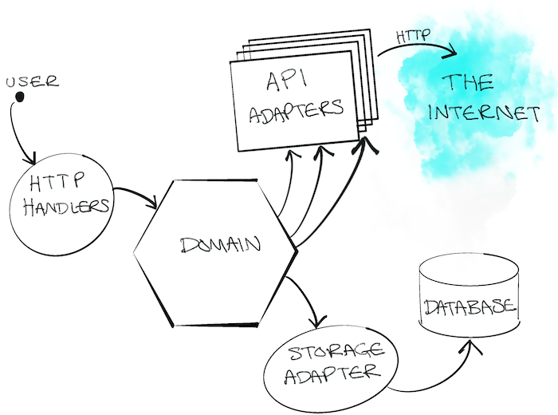
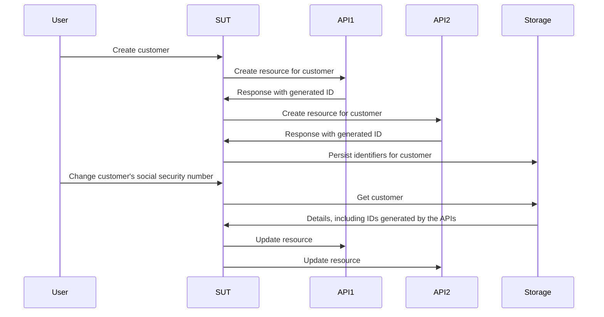
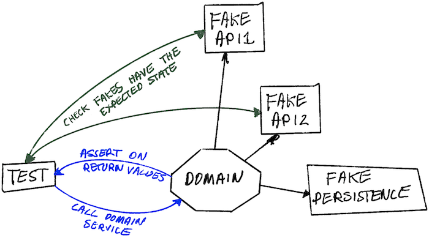
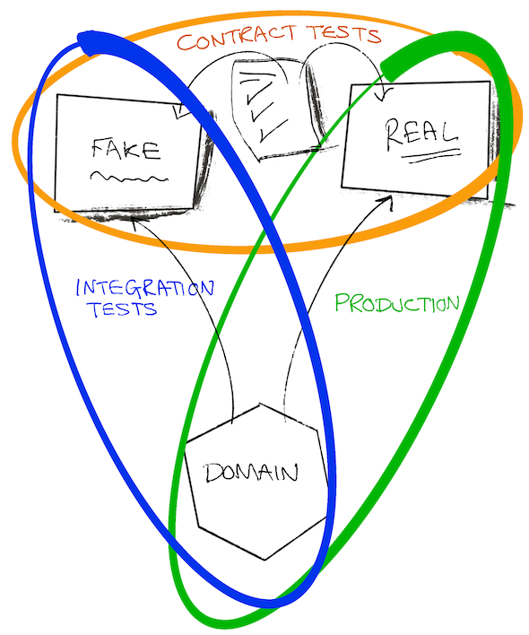

# 不用 mock 的测试

本章将深入测试替身（test double）的世界，探讨它们如何影响测试与开发的过程。我们会揭开传统 mock、stub 和 spy 的局限，并介绍一种更高效、更具适应性的方法：fake 与 contract（契约）。

## tl;dr

- mock、spy 和 stub 会诱使你在每个测试里临时起意地把对依赖行为的假设编码进去。
- 这些假设除了人工核对之外，通常得不到验证，因此会威胁你测试套件的价值。
- fake 和 contract 为我们提供了一种更可持续的方法来打造测试替身：假设是经过验证的，复用性也比其他替身更好。

这一章比平时长不少，所以先来一道清口小菜：你可以先去逛逛这个[示例仓库](https://github.com/quii/go-fakes-and-contracts)。尤其推荐看看那个 [planner 测试](https://github.com/quii/go-fakes-and-contracts/blob/main/domain/planner/planner_test.go)。

---

在 [Mocking](mocking.md) 一章，我们学过 mock、stub 和 spy 如何配合[依赖注入](dependency-injection.md)，成为控制和检查代码单元行为的利器。

不过，随着项目长大，这类测试替身*有可能*变成维护负担，我们应当转而寻找别的设计思路，让系统始终易于理解、易于测试。

**Fake** 和 **contract** 让开发者能用更真实的场景测试系统，以更快、更准的反馈循环改善本地开发体验，并管好不断演进的依赖所带来的复杂度。

### 测试替身入门

看到我这种人较真测试替身的命名学，你大概会翻个白眼，但这些形形色色的测试替身，能帮我们把话题和各自的取舍都讲清楚。

**测试替身**是个集合名词，泛指你为**被测对象**（**subject under test**，**SUT**）——也就是你正在测的那个东西——造出的各种可控依赖。比起直接用真实依赖，测试替身往往是更好的选择，因为它能避开这些问题：

- 非得联网才能调用某个 API
- 遭延迟等各种性能问题拖累
- 没法演练非正常路径的场景
- 你的构建和别的团队绑在一起
  - 你总不希望别的团队哪个工程师不小心带了个 bug 上线，你的部署就跟着遭殃吧

在 Go 里，你通常会用接口来建模一个依赖，然后实现自己的版本，以便在测试中控制其行为。**下面就是本文要介绍的几种测试替身**。

假设有一个菜谱 API，它的接口长这样：

```go
type RecipeBook interface {
	GetRecipes() ([]Recipe, error)
	AddRecipes(...Recipe) error
}
```

我们可以用各种方式构造测试替身，取决于你想怎么测一个用到 `RecipeBook` 的东西。

**Stub** 每次被调用都返回同一份写死的数据（canned data）。

```go
type StubRecipeStore struct {
	recipes []Recipe
	err     error
}

func (s *StubRecipeStore) GetRecipes() ([]Recipe, error) {
	return s.recipes, s.err
}

// AddRecipes 从略，以省篇幅
```

```go
// 在测试里，我们可以把 stub 配置成总是返回特定的菜谱，或者返回一个错误
stubStore := &StubRecipeStore{
	recipes: someRecipes,
}
```

**Spy** 和 stub 差不多，但还会记录自己是如何被调用的，这样测试就能断言 SUT 以特定方式调用了依赖。

```go
type SpyRecipeStore struct {
	AddCalls [][]Recipe
	err      error
}

func (s *SpyRecipeStore) AddRecipes(r ...Recipe) error {
	s.AddCalls = append(s.AddCalls, r)
	return s.err
}

// GetRecipes 从略，以省篇幅
```

```go
// 在测试里
spyStore := &SpyRecipeStore{}
sut := NewThing(spyStore)
sut.DoStuff()

// 现在可以检查 spyStore.AddCalls，看看被添加进去的菜谱对不对
```

**Mock** 则像是上面几位的超集：只对特定的调用回以特定的数据。如果 SUT 用错误的参数调用依赖，mock 通常会直接 panic。

```go
// 设置好 mock 的预期调用
mockStore := &MockRecipeStore{}
mockStore.WhenCalledWith(someRecipes).Return(someError)

// 当 SUT 使用这个依赖时，如果没有用 someRecipes 去调用它，mock 通常会直接 panic
```

**Fake** 则像是依赖的“真身”，只是实现方式更适合快速、可靠的测试和本地开发。常见情形是：你的系统在持久化外面包着一层抽象，生产环境用数据库实现，而在测试里，你可以换用一个内存版的 fake。

```go
type FakeRecipeStore struct {
	recipes []Recipe
}

func (f *FakeRecipeStore) GetRecipes() ([]Recipe, error) {
	return f.recipes, nil
}

func (f *FakeRecipeStore) AddRecipes(r ...Recipe) error {
	f.recipes = append(f.recipes, r...)
	return nil
}
```

fake 好用是因为：

- 它们有状态，这对涉及多个主体、多次调用的测试（比如集成测试）很有用。用其他几种测试替身去管理状态，通常是大家不推荐的做法。
- 只要它们的 API 设计得合理，就能提供一种更自然的断言状态的方式。你不必去 spy 依赖的某个具体调用，而是查询它的最终状态，看看你真正想要的效果发生了没有。
- 你可以用它们在本地跑起你的应用，不必拉起或依赖真实的依赖。这通常会改善开发者体验（DX），因为 fake 比真实依赖更快、也更可靠。

spy、mock 和 stub 通常可以借助工具或反射，从接口自动生成。但 fake 编码的是你想为其做替身的那个依赖的行为，至少大部分实现你得亲自动手写。

## stub 和 mock 的问题

[反模式（英文原版）](https://quii.gitbook.io/learn-go-with-tests/meta/anti-patterns)一章讲过，使用测试替身必须小心谨慎。用得不够得体，测试套件很容易变得一团糟。不过随着项目长大，别的问题也会悄悄爬进来。

把行为编码进测试替身时，你其实是把“真实依赖如何运作”的假设写进了测试。一旦替身与真实依赖的行为有出入——或者随着时间推移出现了出入（比如真实依赖变了，这*迟早*要发生）——**你就可能落得测试全绿、软件却不好使的境地**。

stub、spy 和 mock 带来的挑战尤其多，项目一大，问题就冒头。为了讲清楚这一点，我来说说我参与过的一个项目。

### 一个真实案例

*相比真实发生的情况，部分细节已有改动，并为省篇幅大幅简化。*_**如有雷同，纯属巧合。**_

我参与过一个系统，它得调用**六**个不同的 API，分别由全球各地的其他团队编写和维护。它们都算 *REST-ish*——有点 REST 的意思，但也就“有点”。我们系统的职责，是在所有这些系统里创建并管理资源。只要每个系统我们都调用对了，*魔法*（业务价值）就会发生。

我们的应用采用六边形 / 端口与适配器（ports & adapters）架构来组织。领域代码与我们不得不应付的外部乱象是解耦的。所谓“适配器”，实际上就是一些 Go 客户端，把对各个 API 的调用封装了起来。



#### 麻烦来了

自然而然，我们用测试驱动的方式来构建这个系统：用 stub 模拟下游 API 的响应，又配了少量验收测试压阵，好让自己相信一切理应正常。

但我们不得不调用的大部分 API，实际情况是：

- 文档匮乏
- 维护它们的团队身背一堆互相冲突的优先级和压力，很难约到他们的时间
- 测试覆盖不足，于是经常以各种“有趣”而意想不到的方式坏掉、出现回归，等等
- 仍在建设和演进之中

结果就是**一大堆不稳定的测试（flaky tests）**和无尽的头疼。我们*相当*大一部分时间，都花在 Slack 上不断 ping 一堆大忙人，想问清楚：

- 这个 API 怎么突然开始干 `x` 了？
- 我们做 `y` 的时候，API 的行为怎么跟以前不一样了？

软件开发很少像你盼望的那样一帆风顺；它本来就是一个学习的过程。我们得不断弄清那些外部 API 究竟怎么运作。而每学到一点、调整一点，就得更新、补充测试套件——尤其是**修改 stub，让它们跟 API 的实际行为对上**。

麻烦在于，这占掉了我们大量时间，还带来更多失误。当对某个依赖的认知发生变化时，你必须找到**正确的**那个测试去更新 stub 的行为，而且真的很有可能漏改——那些代表同一个依赖的其他 stub 里，假设还原样躺着。

#### 测试策略

除此之外，随着系统长大、需求变化，我们意识到测试策略已经不合时宜。手头只有少量验收测试，让我们相信系统整体能跑；外加针对我们自己写的各个包的大量单元测试。

<u>我们需要某种介于两者之间的东西</u>；我们经常想同时改动系统的多个部分再一起验证，**但又不必为了一次验收测试拉起*整个*系统**。光靠单元测试，我们没法确信各个组件作为整体能协同工作；它们讲不出（也验证不了）我们想要完成的那件事的完整故事。**我们想要的是集成测试**。

#### 集成测试

集成测试证明的是：两个或多个“单元”组合到一起（或者说集成！）时能正确工作。这些单元可以是你自己写的代码，也可以是你的代码与别人的代码集成到一起，比如数据库。

随着项目长大，你会想写更多集成测试，证明系统的大部分能“拼到一起正常工作”——或者叫集成！

你可能心痒想多写些黑盒验收测试，但无论构建时间还是维护成本，它们都会迅速变得昂贵。明明只想检查系统的*一部分*（又不是单个单元）行为是否正常，却要拉起整个系统，代价未免太大。每做一个功能就配上昂贵的黑盒测试，对较大的系统来说不可持续。

#### 有请 fake 登场

问题在于，我们测试单元的方式依赖 stub，而 stub 基本都是*无状态*的。我们想写的测试，要覆盖多次*有状态*的 API 调用：先创建一个资源，过会儿再编辑它。

下面是我们想做的一个测试的精简版。

这里的 SUT 是一个处理“用例”请求的“服务层”。我们想证明：客户创建之后，一旦其资料变更，我们能成功更新先前在各个 API 中创建的资源。

交给团队的需求是这么一条用户故事（user story）：

> ***Given*** 某用户已在 API 1、2、3 完成注册
>
> ***When*** 该客户的社会安全号码发生变更
>
> ***Then**,* 变更会同步传播到 API 1、2、3



横跨多个单元的测试通常跟 stub 合不来，**因为 stub 不适合维护状态**。我们*倒也*可以写黑盒验收测试，但这类测试的成本很快就会失控。

另外，用黑盒测试测边界场景也很麻烦，因为你控制不了依赖。比如我们想证明：某一个 API 调用失败时，回滚机制会被触发。

我们需要的是 **fake**。把依赖建模成有状态的 API、用内存版 fake 实现之后，我们就能写出覆盖面大得多的集成测试，**让我们得以验证真实用例行得通**，而且照样*不必*拉起整个系统，速度几乎与单元测试相当。



用上 fake，**我们可以基于各个系统的最终状态做断言，而不必依赖复杂的 spying**。我们会问每个 fake：这个客户的记录你这儿是什么？然后断言它们已被更新。这感觉自然多了：如果是人工检查系统，我们也会去查询那些 API 的状态，而不是翻请求日志，看我们是不是发过某个特定的 JSON 载荷。

```go
// 拿起我们的乐高积木，为测试把系统拼装起来
fakeAPI1 := fakes.NewAPI1()
fakeAPI2 := fakes.NewAPI2() // 等等
customerService := customer.NewService(fakeAPI1, fakeAPI2, etc...)

// 创建新客户
newCustomerRequest := NewCustomerReq{
	// ...
}
createdCustomer, err := customerService.New(newCustomerRequest)
assert.NoErr(t, err)

// 我们可以像对待普通 API 一样，在各个 fake 里自然地核验所有细节是否符合预期
fakeAPI1Customer := fakeAPI1.Get(createdCustomer.FakeAPI1Details.ID)
assert.Equal(t, fakeAPI1Customer.SocialSecurityNumber, newCustomerRequest.SocialSecurityNumber)

// 对其他我们关心的 API 重复同样的操作

// 更新客户
updatedCustomerRequest := NewUpdateReq{SocialSecurityNumber: "123", InternalID: createdCustomer.InternalID}
assert.NoErr(t, customerService.Update(updatedCustomerRequest))

// 同样可以查看各个 fake 的最终状态，看看是不是我们想要的样子
updatedFakeAPICustomer := fakeAPI1.Get(createdCustomer.FakeAPI1Details.ID)
assert.Equal(t, updatedFakeAPICustomer.SocialSecurityNumber, updatedCustomerRequest.SocialSecurityNumber)
```

比起通过 spy 去核对一坨函数调用的参数，这样写起来更简单，读起来也更容易。

有了这个思路，我们就能让测试横跨系统的大片区域，就站会上讨论的那些用例写出更**有意义**的测试，同时执行速度依然快得惊人。

#### fake 带来更多封装的好处

在上面的例子里，测试除了核对依赖的最终状态，并不关心依赖是怎么表现的。我们创建了各个依赖的 fake 版本，把它们注入被测的那部分系统。

换成 mock/stub，每个依赖都得设置一番，让它应对特定场景、返回特定数据等等。这等于把行为和实现细节拖进了测试，削弱了封装的好处。

我们把依赖藏在接口后面建模，为的就是作为调用方的*我们不必关心它怎么运作*；可一旦走“mock 主义”（mockist）的路数，*我们**在每个测试里**都不得不关心*。

#### fake 的维护成本

至少从要写的代码量来说，fake 比其他测试替身贵：它们得自己维护状态，还得模拟被替代对象的行为。fake 与真实之物之间的任何行为偏差，都**带着一种风险**：你的测试与现实脱节。于是又回到那个局面——测试全过，软件却坏了。

每当与另一个系统集成——无论是别的团队的 API 还是数据库——你都会基于它的行为做出种种假设。这些假设可能来自 API 文档、当面交谈、邮件、Slack 讨论串等等。

如果我们能把假设**固化成代码**，拿去对着 fake*和*真实系统都跑一跑，以可重复、有文档的方式检验我们的认知是否正确，岂不美哉？

**Contract** 正是达成此事的手段。它帮我们管理对别家系统的种种假设，并让它们白纸黑字、明明白白。比起邮件往来、比没完没了的 Slack 讨论串，明确得多，也有用得多！



有了 contract，我们就可以放心地把 fake 和真实依赖互换着用。这不仅对搭建测试有用，对本地开发同样有用。

下面是系统所依赖的某个 API 的一份 contract 示例

```go
type API1Customer struct {
	Name string
	ID   string
}

type API1 interface {
	CreateCustomer(ctx context.Context, name string) (API1Customer, error)
	GetCustomer(ctx context.Context, id string) (API1Customer, error)
	UpdateCustomer(ctx context.Context, id string, name string) error
}

type API1Contract struct {
	NewAPI1 func() API1
}

func (c API1Contract) Test(t *testing.T) {
	t.Run("can create, get and update a customer", func(t *testing.T) {
		var (
			ctx  = context.Background()
			sut  = c.NewAPI1()
			name = "Bob"
		)

		customer, err := sut.CreateCustomer(ctx, name)
		expect.NoErr(t, err)

		got, err := sut.GetCustomer(ctx, customer.ID)
		expect.NoErr(t, err)
		expect.Equal(t, customer, got)

		newName := "Robert"
		expect.NoErr(t, sut.UpdateCustomer(ctx, customer.ID, newName))

		got, err = sut.GetCustomer(ctx, customer.ID)
		expect.NoErr(t, err)
		expect.Equal(t, newName, got.Name)
	})

	// 举例：我们没预料到的古怪行为
	t.Run("the system will not allow you to add 'Dave' as a customer", func(t *testing.T) {
		var (
			ctx  = context.Background()
			sut  = c.NewAPI1()
			name = "Dave"
		)

		_, err := sut.CreateCustomer(ctx, name)
		expect.Err(t, ErrDaveIsForbidden)
	})
}
```

正如[扩展验收测试](scaling-acceptance-tests.md)中所讨论的，针对接口而非具体类型来测试，测试就能做到：

- 与实现细节解耦
- 可以在不同上下文中复用。

而这正是 contract 需要满足的条件。它让我们既能验证、开发自己的 fake，*又能*拿它对着真实实现来测。

要创建内存版 fake，可以在测试里用这个 contract：

```go
func TestInMemoryAPI1(t *testing.T) {
	API1Contract{NewAPI1: func() API1 {
		return inmemory.NewAPI1()
	}}.Test(t)
}
```

这是 fake 的代码

```go
func NewAPI1() *API1 {
	return &API1{customers: make(map[string]planner.API1Customer)}
}

type API1 struct {
	i         int
	customers map[string]planner.API1Customer
}

func (a *API1) CreateCustomer(ctx context.Context, name string) (planner.API1Customer, error) {
	if name == "Dave" {
		return planner.API1Customer{}, ErrDaveIsForbidden
	}

	newCustomer := planner.API1Customer{
		Name: name,
		ID:   strconv.Itoa(a.i),
	}
	a.customers[newCustomer.ID] = newCustomer
	a.i++
	return newCustomer, nil
}

func (a *API1) GetCustomer(ctx context.Context, id string) (planner.API1Customer, error) {
	return a.customers[id], nil
}

func (a *API1) UpdateCustomer(ctx context.Context, id string, name string) error {
	customer := a.customers[id]
	customer.Name = name
	a.customers[id] = customer
	return nil
}
```

### 软件的演进

大多数软件都不是一次发布就“完工”、从此定型的。

它是一个渐进的学习过程，要适应客户需求和种种外部变化。在我们的例子里，被调用的那些 API 自身也在演进变化；而且随着我们不断开发*自己的*软件，对自己*真正*需要怎样的系统也了解得更深。我们在 contract 里做过的假设，有的被发现本来就是错的，有的则*后来*变成了错的。

好在 contract 的架子搭好之后，应对变化就有一套简单流程。每当学到新东西——可能是一个 bug 修完后的领悟，也可能是同事告诉我们 API 要变了——我们就：

1. 写一个测试来演练新场景。其中一部分，是修改 contract，让它**驱动**你在 fake 中模拟出相应行为
2. 运行测试应该会失败，但先别改别的：把 contract 对着真实依赖跑一遍，确认对 contract 的修改是有效的。
3. 更新 fake，让它符合 contract。
4. 让测试通过。
5. 重构。
6. 跑全部测试，然后发布。

提交前跑*全量*测试套件时，*可能*会因为 fake 的行为变了而挂掉其他测试。这是**好事**！这下你可以把系统里其他依赖这一改动的地方统统修好，并且心里有底：它们在生产环境同样能处理好这个场景。没有这套方法，你就得*靠自己记住*去找所有相关测试、更新那些 stub。容易出错、费时费力，还无聊。

### 更胜一筹的开发者体验

手握一套配有 contract 的 fake，感觉就像有了超能力。我们总算驯服了那些不得不面对的 API 的复杂度。

为各种场景写测试变得简单多了。我们再也不用为每个测试拼装一整套 stub 和 spy；只需拿起我们的那组单元或模块（fake，还有我们自己的“服务”），就能非常轻松地把它们组装起来，演练我们需要的各种千奇百怪的场景。

凡是用 stub、spy 或 mock 写的测试，由于那些临时拼凑的设置，都得去 *care* 外部系统的行为。而 fake 可以当作任何一个封装良好的普通代码单元来对待：细节对你隐藏，拿来就用。

我们能在本地跑一个非常接近真实的系统，而且全在内存里，启动和运行都快极了。这意味着我们的测试速度飞快——考虑到测试套件覆盖之全面，这感觉相当了不起。

如果验收测试在预发（staging）环境挂了，我们的第一步就是把 contract 对着我们依赖的那些 API 跑一遍。很多时候，问题是我们**抢在对方系统的开发者之前**发现的。

### 用装饰器应付非正常路径

到了错误场景，stub 反而更方便：在测试里你能直接掌控它*如何*表现；fake 则往往相当黑盒。这是有意为之的设计选择——我们希望 fake 的使用者（比如测试）不必关心它内部怎么运作；有 contract 背书，使用者应当信任它们会把事情做对。

那怎么让 fake 出错，好演练那些非正常路径的场景呢？

开发者常常需要在不动源代码的前提下修改某段代码的行为。**装饰器模式（decorator pattern）**就是一种常用手法：拿一个代码单元，给它添上日志、遥测、重试之类的能力。我们也可以用它包住 fake，在必要时覆盖其行为。

回到 `API1` 的例子，我们可以创建一个类型，实现所需的接口，并把 fake 包在里面。

```go
type API1Decorator struct {
	delegate           API1
	CreateCustomerFunc func(ctx context.Context, name string) (API1Customer, error)
	GetCustomerFunc    func(ctx context.Context, id string) (API1Customer, error)
	UpdateCustomerFunc func(ctx context.Context, id string, name string) error
}

// 断言 API1Decorator 实现了 API1
var _ API1 = &API1Decorator{}

func NewAPI1Decorator(delegate API1) *API1Decorator {
	return &API1Decorator{delegate: delegate}
}

func (a *API1Decorator) CreateCustomer(ctx context.Context, name string) (API1Customer, error) {
	if a.CreateCustomerFunc != nil {
		return a.CreateCustomerFunc(ctx, name)
	}
	return a.delegate.CreateCustomer(ctx, name)
}

func (a *API1Decorator) GetCustomer(ctx context.Context, id string) (API1Customer, error) {
	if a.GetCustomerFunc != nil {
		return a.GetCustomerFunc(ctx, id)
	}
	return a.delegate.GetCustomer(ctx, id)
}

func (a *API1Decorator) UpdateCustomer(ctx context.Context, id string, name string) error {
	if a.UpdateCustomerFunc != nil {
		return a.UpdateCustomerFunc(ctx, id, name)
	}
	return a.delegate.UpdateCustomer(ctx, id, name)
}
```

于是在测试里，我们可以用 `XXXFunc` 字段来修改这个测试替身的行为，就像你用 stub、spy 或 mock 时那样。

```go
failingAPI1 = NewAPI1Decorator(inmemory.NewAPI1())
failingAPI1.UpdateCustomerFunc = func(ctx context.Context, id string, name string) error {
	return errors.New("failed to update customer")
}
```

不过，这*确实*别扭，而且需要你自己拿捏分寸：这种做法等于在测试里给 fake 引入了临时行为，你也就失去了 contract 给你的保证。

最好审视一下自己的处境，你也许会得出结论：特定的非正常路径，用 stub 在单元测试层面去测反而更简单。

### 这些额外的代码不是浪费吗？

觉得只该写“直接服务客户”的代码、还能指望得到一个能高效在其上构建的系统——这是一厢情愿。人们对“什么是浪费”的看法相当扭曲（参见我的文章：[亨利·福特的幽灵正在毁掉你的开发团队](https://quii.dev/The_ghost_of_Henry_Ford_is_ruining_your_development_team)）。

自动化测试不会直接让客户受益，但我们写它是为了让自己干活更高效（你写测试总不是为了刷覆盖率吧？）。

工程师必须能轻松模拟各种场景（以可重复的方式，而不是临时起意），才能调试、测试、修复问题。**内存版 fake 加上良好的模块化设计，让我们能把一个场景涉及的相关角色隔离出来，极其低成本地写出快速而恰当的测试**。有了这种灵活性，开发者迭代系统的方式就可控得多——不必对着一个盘根错节的大泥球，靠写起来、跑起来都很贵的黑盒测试（更惨的是在共享环境上手动测试）来兜底。

这就是 [simple vs. easy](https://www.youtube.com/watch?v=SxdOUGdseq4)（“简单”与“容易”之别）的一个例子。诚然，短期内 fake 和 contract 会让你比用 stub 和 spy 多写一些代码，但换来的是长期看更清爽、维护起来更便宜的系统。零零碎碎地更新 spy、stub 和 mock 又费人力又容易出错，因为你没有对应的 contract 来检查你的测试替身行为是否正确。

这套方法的*前期*成本略高一点，但 contract 和 fake 一旦就位，后续成本就低得多了。比起 stub 这类临时拼凑的测试替身，fake 更可复用，也更可靠。

写新测试时，与其现搭一个 stub，不如拿一个现成的、身经百战的 fake 来用——那种感觉*非常*解放，而且给你**信心**。

### 这套方法怎么融入 TDD？

我不建议*一上来*就写 contract；那是自底向上的设计。总的来说，我觉得走那条路要求我自己更聪明才行，而且有个风险：对着假想中的需求想太多。

这项技术与“验收测试驱动方法”是兼容的——前面章节、[The Why of TDD](https://quii.dev/The_Why_of_TDD) 以及 [GOOS](http://www.growing-object-oriented-software.com)（《Growing Object-Oriented Software, Guided by Tests》）里都讨论过：

- 写一个失败的[验收测试](scaling-acceptance-tests.md)。
- 逼出足够的代码让测试通过，这通常会产出一个“服务层”，它依赖某个 API、数据库或别的什么。通常，你的业务逻辑代码会经由接口与外部关注点（比如持久化、调用数据库等）解耦。
- 先实现一个内存版 fake 来满足接口，让所有测试在本地通过，同时验证最初的设计。
- 要上生产，内存版可不行！把你对着 fake 做的假设固化成一个 contract。
- 用这个 contract 去打造真实依赖，比如 MySQL 版的存储。
- 发布。

## 讲数据库测试的那一章呢？

这是大家催了很久的话题，我拖了五年多。原因是：这一章永远都会是我的回答。

<u>不要 mock 数据库驱动、spy 它收到的调用</u>。这种测试难写，而且潜在价值很低。你不该断言某条特定的 `SQL` 语句有没有被发给数据库——那是实现细节；**你的测试只应关心行为**。证明某条特定的 SQL 语句被编译过，*并不能*证明你的代码*表现出*你需要的行为。

**Contract** 会逼着你把测试与实现细节解耦，聚焦行为。

按上文描述的 TDD 方法，把你的持久化需求逼出来。

[这个示例仓库](https://github.com/quii/go-fakes-and-contracts)里有若干 contract 示例，展示了如何用它们来测试某些持久化需求的内存实现和 SQLite 实现。

```go
package inmemory_test

import (
	"github.com/quii/go-fakes-and-contracts/adapters/driven/persistence/inmemory"
	"github.com/quii/go-fakes-and-contracts/domain/planner"
	"testing"
)

func TestInMemoryPantry(t *testing.T) {
	planner.PantryContract{
		NewPantry: func() planner.Pantry {
			return inmemory.NewPantry()
		},
	}.Test(t)
}
```

```go
package sqlite_test

import (
	"github.com/quii/go-fakes-and-contracts/adapters/driven/persistence/sqlite"
	"github.com/quii/go-fakes-and-contracts/domain/planner"
	"testing"
)

func TestSQLitePantry(t *testing.T) {
	client := sqlite.NewSQLiteClient()
	t.Cleanup(func() {
		if err := client.Close(); err != nil {
			t.Error(err)
		}
	})

	planner.PantryContract{
		NewPantry: func() planner.Pantry {
			return sqlite.NewPantry(client)
		},
	}.Test(t)
}
```

虽然 Docker 这类工具*确实*让本地跑数据库容易了些，但性能开销依然不小。有了配着 contract 的 fake，你就可以把“较重”依赖的使用限制在验证 contract 之时，其他类型的测试完全用不着它。

系统*其余*部分的验收测试和集成测试都改用内存版 fake，能带来快得多、也简单得多的开发者体验。

## 总结

软件项目常常这样组织：多个团队各自构建系统，齐头并进，朝一个共同目标努力。

这种工作方式要求高度的协作与沟通。很多人觉得，用“API 优先”的思路，先定好一些 API 契约（常常就是 wiki 上的一页！），然后各干各的六个月，最后拼到一起就行。实践里这很少行得通：一旦开始写代码，我们对领域和问题的理解会加深，原有的假设随之动摇。我们不得不应对这些认知的变化，而这往往需要跨团队的改动。

所以，如果你正处于这种局面，就需要以最优的方式组织和测试你的系统，来应对你所处的系统内外那些无法预测的变化。

> “软件开发中高性能团队的一个决定性特征，是他们无需向小团队之外的任何人、任何群体请示，就能取得进展、改变主意。”
>
> Modern Software Engineering
> David Farley

别指望周会或 Slack 讨论串能把变化聊清楚。**把你的假设固化成 contract**。在构建流水线里让这些 contract 对着真实系统跑，一旦有新情况浮出水面，你就能快速得到反馈。有了这些 contract，再加上 **fake**，你就能独立推进工作，并可持续地消化外部变化。

### 把你的系统当作一组模块

回到 Farley 那本书，我说的正是**渐进主义**（incrementalism）的理念。构建软件是一场*持续不断的学习*。想在一开始就吃透一个系统为交付价值所必须解决的全部需求，并不现实。所以，我们必须优化系统和我们的工作方式，做到**快速收集反馈、放手实验**。

要用好本章讨论的这些理念，你需要一个**模块化的系统**。有了模块化的代码加上可靠的 fake，你就能借助自动化测试，低成本地在系统上做实验。

我们发现，把那些古怪的、假想的（但可能发生的）场景转写成一个个自包含的测试，简直易如反掌：把模块拼到一起，换不同的数据、换不同的顺序，让某些 API 出错……如此这般，既帮我们理解了问题，也逼出了更健壮的软件。

定义清晰、测试完备的模块让你可以一小步一小步地推进系统，而不必一次性改动并弄懂*全部*东西。

### 可我要做的东西很小，API 也很稳定啊

就算 API 稳定，你也不会希望自己的开发者体验、构建流程等等跟别人的代码紧紧耦合在一起。这套方法用顺了之后，你手里会有一组可组合的模块：上生产、在本地跑、用你信任的替身写各种类型的测试，都是把它们拼装起来的事。

它让你能隔离出系统中你关心的部分，就你真正要解决的问题写出有意义的测试。

### 让你的依赖成为一等公民

当然，stub 和 spy 有它们的位置。在测试里临时模拟依赖的各种行为，永远有其用武之地，但小心别让成本失控。

职业生涯里，我见过太多次：能干的开发者精心写出的软件，最后栽在了集成问题上。集成之所以让工程师头疼，*正是因为*你要复现别人写的系统的精确行为，而人家还在同时改它。

有的团队靠大家往共享环境里部署、在那里测试。问题在于，这样你得不到**隔离的**反馈，而且**反馈很慢**。你也依然没法就“系统如何与其他依赖协作”构建各种不同的实验，至少效率高不了。

**我们得用更讲究的依赖建模方式来驯服这种复杂度**，赶在上生产之前，就在自己的开发机上快速测试/实验。给你的依赖造出逼真又可控的 fake，再用 contract 加以验证。然后，你就能开始写更有意义的测试、在系统上做实验，成功的把握也就更大。
